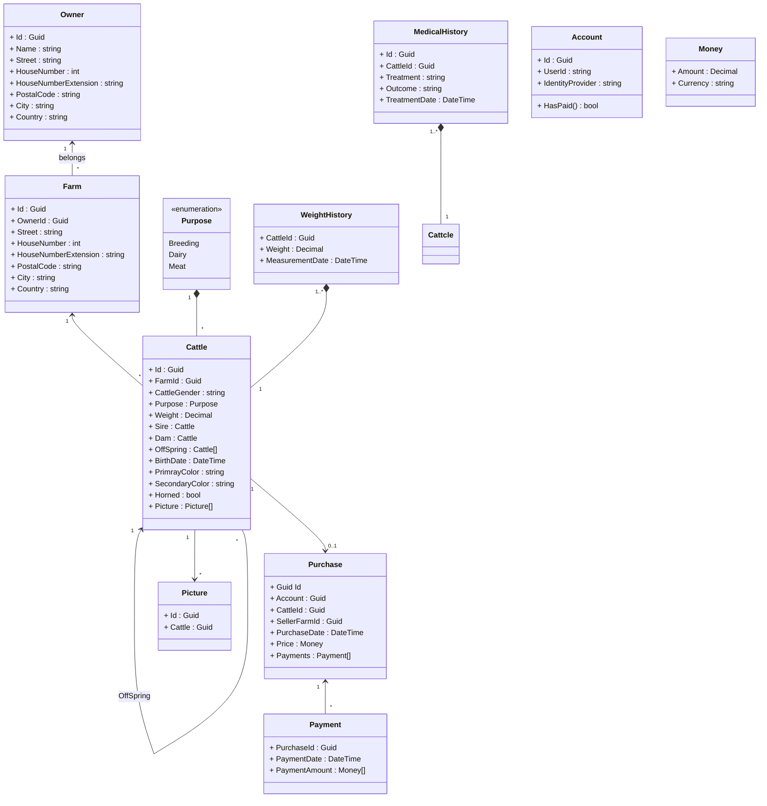

# Structure

```mermaid
classDiagram
  Account
  Owner "1" <-- "*" Farm : belongs
  Farm "1" <-- "*" Cattle
  Purpose "1" *-- "*" Cattle
  WeightHistory "1..*" *-- "1" Cattle
  MedicalHistory "1..*" *-- "1" Cattcle
  Cattle "1" <-- "*" Cattle : Father
  Cattle "1" <-- "*" Cattle : Mother
  Cattle "1" <-- "*" Cattle : OffSpring
  Cattle "1" --> "0..1" Purchase 
  Cattle "1" --> "*" Picture
  Purchase "1" <-- "*" Payment
  class Account{
    + Id : Guid
    + UserId : string
    + IdentityProvider : string
    + HasPaid() bool
  }
  class Owner {
    + Id : Guid
    + Name : string
    + Street : string
    + HouseNumber : int
    + HouseNumberExtension : string
    + PostalCode : string
    + City : string
    + Country : string
  }
  class Farm {
    + Id : Guid
    + OwnerId : Guid
    + Street : string
    + HouseNumber : int
    + HouseNumberExtension : string
    + PostalCode : string
    + City : string
    + Country : string
  }
  class Cattle {
    + Id : Guid
    + FarmId : Guid
    + CattleGender : string
    + Purpose : Purpose 
    + Weight : Decimal
    + Sire : Cattle
    + Dam : Cattle
    + OffSpring : Cattle[]
    + BirthDate : DateTime
    + PrimrayColor : string
    + SecondaryColor : string
    + Horned : bool
    + Picture : Picture[]
  }
  class Purpose{
    <<enumeration>>
    Breeding
    Dairy
    Meat
  }
  class WeightHistory {
    + CattleId : Guid
    + Weight : Decimal
    + MeasurementDate : DateTime
  }
  class MedicalHistory {
    + Id : Guid
    + CattleId : Guid
    + Treatment : string
    + Outcome : string
    + TreatmentDate : DateTime
  }
  class Purchase {
    + Guid Id
    + Account : Guid
    + CattleId : Guid
    + SellerFarmId : Guid
    + PurchaseDate : DateTime
    + Price : Money
    + Payments : Payment[]
  }
  class Payment {
    + PurchaseId : Guid
    + PaymentDate : DateTime
    + PaymentAmount : Money[]
  }
  class Money {
    + Amount : Decimal
    + Currency : string
  }
  class Picture {
    + Id : Guid
    + Cattle : Guid
  }
```
